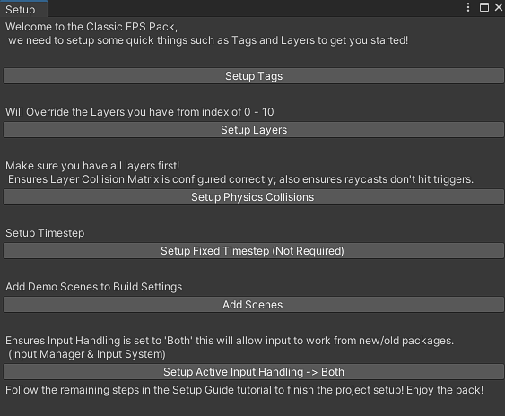

# Classic FPS Pack

The Classic FPS Pack developed by [Ajay Venkat](https://www.youtube.com/c/AJTechTV) and [Thomas Brush](https://www.youtube.com/c/AtmosGames), was created as a way to make developing Simple FPS Games easier. Most FPS Assets are bloated and hard to understand, this pack contains scripts that are easy to modify and prefabs that are easy to understand to help you quickly setup a prototype.

It is currently being used in an upcoming indie game [Father](https://store.steampowered.com/app/1575990/Father/) by Thomas Brush.

**Recommended Approach**:

1. Video Documentation for General Learning & Conceptual understanding of pack
2. Scripting API for understanding scripts & changing functionality
3. Scripting Extension for creating new Scripts that interact with the pack

## Setup

Before following any documentation ensure that the setup is completed. To setup, use the `Classic FPS > Setup` editor and follow all the steps to have the necessary layers, tags, physics settings etc.

Ensure you go through one by one and do these, each one is important for the pack to function (except 4):

1. **Setup Tags** : Setup all the tags needed for the Pack

2. **Setup Layers** : Setup all the layers needed to run the Pack

3. **Setup Physics Collisions** : Setup all the layer vs layer collisions (ex. Enemy doesn't collide with Enemy)

4. **Setup Fixed Timestep** : Make the game physics run more smooth

5. **Add Scenes** : Add all the demo scenes to Build Settings

6. **Setup Active Input Handling** : This ensures that both the new and old input system are used so that all systems can be used with this pack. [Restart Required!]

## Video Documentation

This pack has been documented in 2 forms, both in video form as well as written form. The video documentation contains information about each of the systems within the pack and will give you a good starting point to use them.

This site will give a more detailed account of every script in the pack and give you the groundwork to extend it.

**Link to Playlist**: [Video Documentation Playlist](https://youtube.com/playlist?list=PL9FeLoYIHiTyYr5zPLr2RtjX8T41PIArx)

## Scripting Documentation

This section covers the following:

1. Every script in the pack & what it does
2. How to access the script
3. The public functions/variables in the script
4. General usage guidelines

[**Lets Get Started!**](scripting_docs/scripting_docs.md)
