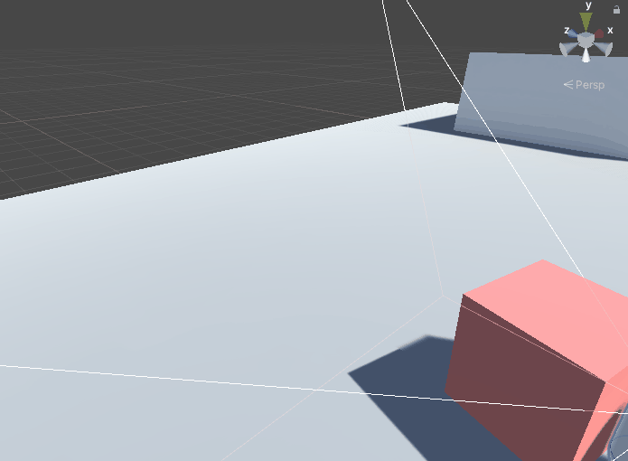

# Pushable Object

By default the Player can move Rigidbodies; however sometimes this can lead to unstable or unwanted behaviour. The Pushable Object script allows you to control some of those parameters.

This script is also responsible for allowing an Object in the scene to be picked up and thrown either through a Gravity Gun or by the default player pickup.

It also handles things such as playing an impact sound effect.

The [`PlayerPhysics`](../controller/PlayerPhysics.md) script interacts with the Pushable Objects the most; especially in with the **pushPower** and **pushableObjectVelocityMax** variables; please read [`PlayerPhysics`](../controller/PlayerPhysics.md) first to understand the effect on Pushable Objects.

## Functionality

A few things affect the movement of the Pushable objects:

1. **pushPower** of `PlayerPhysics`: How much force to apply to the Object that you are pushing up against.

2. **pushableObjectVelocityMax** of `PlayerPhysics`: If this is not limited then the Player can add infinite force to an Object.

3. **speed** of `PlayerController`: How much speed the player has when pushing against this object.

4. The properties of the **Rigidbody** attached to the Pushable object

   - The Mass of the Rigidbody that the Player is trying to push
   - The Angular Drag of the Rigidbody that the Player is trying to push
   - The Drag of the Rigidbody that the Player is trying to push

## Public Variables

The public variables mostly affect the behaviour of the object:

1. **canBePickedUp**: This determines whether or not the player can pickup the object either by default or through a Gravity Gun.

2. **maximumVelocity**: Safety option to ensure object never goes above a certain velocity (angular velocity is also impacted here).

3. **minimumVelocityBeforeAudio**: The minimum velocity on impact to create an impact sound.

4. **objectHoldingOffset**: This is a manual value that determines how far away to hold the object when it is picked up.

5. **precalculateBounds**: If this is `true` then the previous parameter is rendered useless; the precalculate bounds attempts to estimate where to place the object depending on its size.

6. **impactSound**: Sound when the object collides with something.

7. **onShootSound**: Sound to play when the object is shot.

8. **waitBeforePlayingSFXAgain**: Minimum delay between two SFX.

### Drag Forces

In the **Rigidbody** component you will only have access to one drag parameter; so if you want rigid movement on X/Z axis without affecting how the object falls; this is not possible.

This is why further drag options are provided here to affect individual axis:

1. **xAxisDrag**, **yAxisDrag**, **zAxisDrag**: The drag on each of the axis.

## Creating a Pushable Object

For example, you want a simple cube that you can push on the ground. Simply create a **Cube** GameObject, then follow these steps:

1. Assign the **PushableObject** Component to the object

   - You can modify the **_Velocity Drag_** to individually affect the different axis' Drag **after** the Player loses contact with the object (can prevent sliding effect).

2. Ensure there is a Collider on the object

   - A **primitive** Collider is recommended here (Cube, Sphere, Capsule) as the forces can behave unrealistically on more complex geometry.

3. Ensure there is a Rigidbody on the object

   - If you want the Cube to just move along the surface of the ground then you can **_Freeze Rotation_** on the **_X_** and **_Z_** axis.

   - If you don't want the Cube to rotate too much then you can bump up the **_Angular Drag_**.

The GameObject would behave something like this:

Lets bump up the X & Z drag on the Pushable Object script, this will lead to some nicer behaviour:

### Optimisations

The **Pushable Object** script is heavily optimised, it does **not** have an `Update()` function, it only runs when the Player is pushing the object, so a scene can contain many Pushable objects.
