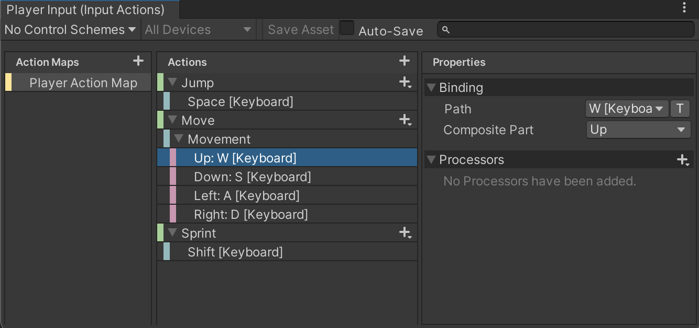

# Player Input

## Configuration

Knowing how to configure the **PlayerInput** is very important, the **PlayerInputManager** simply listens to any events triggered by the **PlayerInput** (different to PlayerInputManager) Component. However, the keys that trigger these events can be defined by you.

Currently these are the controls:

1. **WASD** : Movement along two axis (forward/backward and left/right)
2. **Shift** : Increases the Player speed to sprinting
3. **Space** : Performs the Jump movement
4. **E**: Pickup item that is on crosshair
5. **Left Mouse Button**: Throw item that is on crosshair (also attack for weapon but that is handled on the Weapon component)
6. **Right Mouse Button**: Drop currently picked up item; down

However, what if you need to support this Player on a different system?

To solve this problem the Player utilises the new **Unity Input System**, you can learn in a lot more detail about it [here](https://www.raywenderlich.com/9671886-new-unity-input-system-getting-started).

Place your attention on the Inspector window and find the **PlayerInput** Component, look at the **Actions** property. The asset found in that field determines what Inputs trigger what functions. You can find this asset in **_Samples\Sample Presets\Prefabs\Player\Input_**. You can double click on the asset to open up the Input System Editor.

This is where you will modify Input bindings.

Notice how I have expanded **Movement** then selected **Up**. In the right most panel is where I can change the binding for the action, the **PlayerInputManager** will handle getting information from that new key/joystick/mouse source.

Each of these inputs are mapped to a method in the Player Input Manager, if you look at the **Player Input** component.

## Public Access

1. **GenerateMovementVector()**: This takes the current input and gives out the current movement vector of the Player, it also does some extra calculations to the the current ground into account to develop a more smooth movement vector.

You should **not** call this function in general however as this is called by the `PlayerController`.

To get the last generated movement vector use the public **processedInputs** variable. To get the raw input data use the **inputData** variable.

These can be used to determine for example when to play a walking sound.
