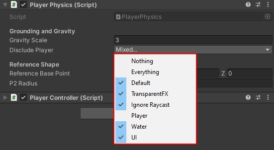

# Player Physics

The **PlayerPhysics** Component provides some helper functions to the **PlayerController** that allow it to perform some of the following tasks:

1. Raycast from the Player
2. Spherecast from the Player
3. Check whether it is grounded
4. Check if the Player is in the wall, if so push it out

## Variables

- **Capsule Collider**: The collider you want to use to detect wall sticking, it should extend a little bit outside the bounds of the Character Controller's capsule (this is pre-configured).

- **Gravity Scale** : How quickly the Player is brought down to the ground, where the scaling is relative to the default Unity gravity (-9.81).

- **Disclude Player** : This is the LayerMask ensuring that any Raycasts/Spherecasts from the Player do not intersect with the Player itself.

Note how the **Player** layer is disabled while everything else is enabled, this is why we set the FPSController and all it's children layers to **Player**.

- **Reference Base Point** : Where the 'bottom-half' of the Player lies relative to `(0,0,0)` being the direct center of the Player.

- **Base Radius** : The radius of the 'bottom-half' of the Player, this is the sphere that will be used to check against the ground for the groundind status.

## Collision & Interaction

Collision is handled one of two ways in this pack, either through the Capsule Collider on the Character Controller component or through some amount of sphere colliders you have determined. 

The collisions defined here are how it affects the other objects in the scene such as pushable objects, rigidbodies etc. 

Setting up these colliders is explained more in this video : [Setting up Interactive Objects](https://youtu.be/DvAF9Dlc-bk)

The variable in charge of this is:

- **Collision Colliders**: Here you can drag in any amount of sphere colliders to detect collisions with.

- **Use Fixed Update**: Set this to true if you can afford a very low fixed timestep, otherwise set this to false and the collisions will be claculated on Update. 

- **Use Custom Spheres**: Set this to true when you are using custom sphere collision, however if you set this to false; then you must set **useFixedUpdate** to true because the default collision only works on fixed update.

- **Push Power**: How much force to exert onto the Rigidbodies the player comes into cntact with.

- **Push Object Velocity Max**: The max force that can be exerted on an object to ensure the objects don't fly off really fast.

