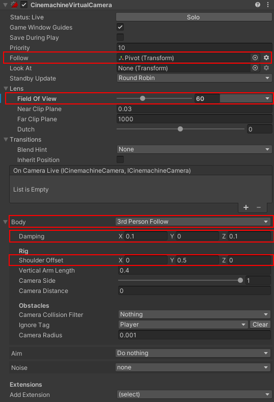

# Cinemachine Properties

It's important to note that the **CinemachineVirtualCamera** directly controls the Camera and its properties so you won't have to work directly with the Camera in this project.



There are a lot of setting to play with here, but for a **FPS** based Camera, take a look at the options highlighted. These are the most important ones.

1. **Follow** : By attaching the **Pivot** GameObject, the Camera will follow the Pivot object. A benefit of this is that you can modify the pivot position, it is not restricted to the direct center of the Player. 

2. **Field Of View** : Controls the Field of View property on the Camera directly.

3. **Body** : This is the most important one, you will notice that the **3rd Person Follow** is selected, all this does is it rotates the Camera to look at the **Follow** object and in the direction of the **Follow** object. Hence, by modifying the rotation of the **Pivot** GameObject we also modify the Camera rotation. 

4. **Damping** : By selectin ghte **3rd Person Follow** we get many advantages such as the ability to add damping to the movement of the Camera, this can remove any minor jittering in the Camera and give a smooth feel, however if you want you can set it to ```(0,0,0)``` to remove it.

5. **Shoulder Offset** and **Vertical Arm Length** : These properties can help you position your Camera relative to the **Pivot** GameObject, so you can make your FPS Controller appear taller than it really is without modifying the height.

Other options include the **Camera Distance**, by simply increasing this you now have a 3rd Person Controller, the **Player Controller** will function exactly the same. This is why Cinemachine is used, it is extremely simple to extend upon and change to fit what you like.